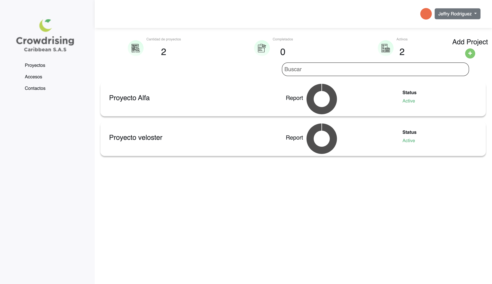
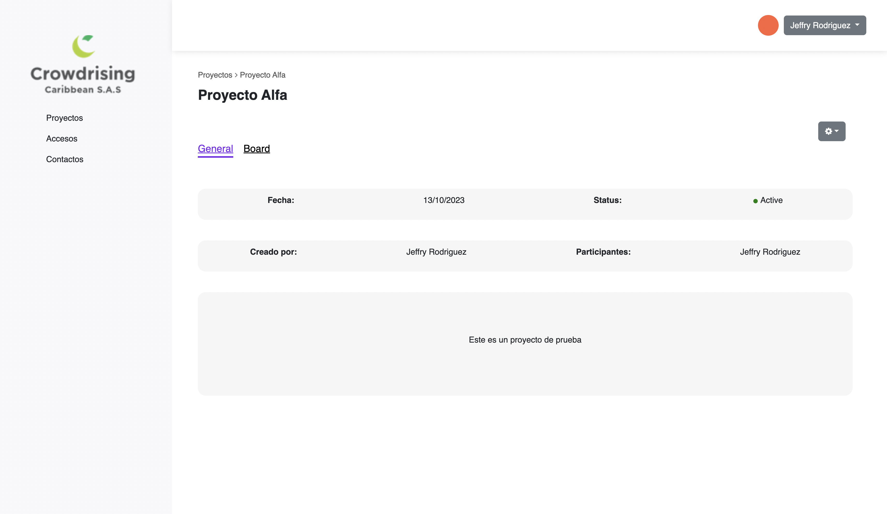
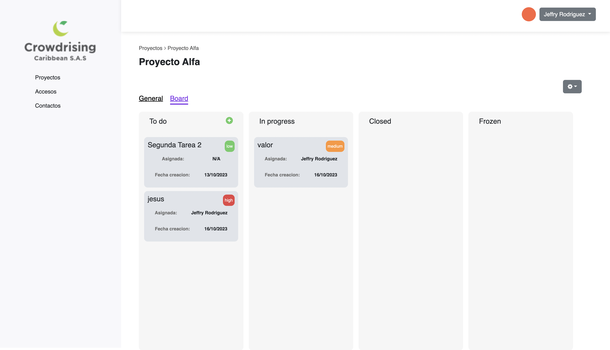

# ProjectManajer

This project is build in angular 16 and storage data in json file expose by Json Server

## Need to Runs

Install Angular 
Instalar JsonServer y exponer por el puerto 3000

## How In 

User configure to access 

User - jf@gmail.com
pass - 123456

## Screens

